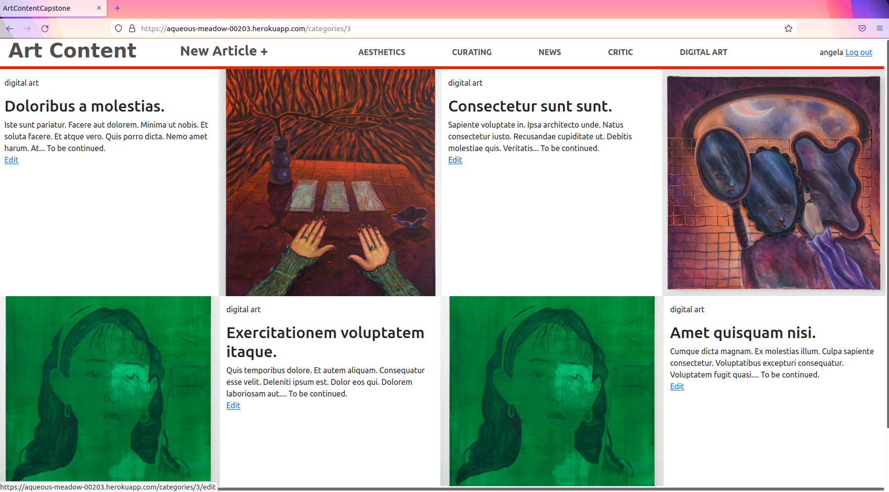

# Art_Content Blog

> Microverse Capstone project! A blog app with multiple articles that involves art and technology that includes voting features, image uploading, and a nice grid layout. DESKTOP APP ONLY.*



## Built With

- Ruby 2.7.3
- Rails 6.1.3
- PostgreSQL
- Webpack and Yarn for Javascript

# Featured gems

- Faker
- FactoryBot

## Live Demo

Check out the Heroku development deployment [here](https://aqueous-meadow-00203.herokuapp.com/users/sign_in)


## Getting Started

To get a local copy up and running follow these simple example steps.

### Before Steps

Create an AWS3 key to store your images in a bucket (for development).

Setup the application with the following commands:

```
bundle install
```

Then configure and seed the database with:

```
rails db:create db:migrate db:seed
```

### Usage

For local development fire up the server in `localhost:3000` using:
```
rails s
```
### Test the application

You can make sure everything is fine by using the following command:
```
rspec
```

### Deployment


## Authors

👤 **Angela Cuahutle**

- Github: [@angelacuahutle](https://github.com/angelcuahutle)
- Linkedin: [@angelacuahutle](https://www.linkedin.com/in/angelacuahutle/)

## 🤝 Contributing

Contributions, issues, and feature requests are welcome!

Feel free to check the [issues page](issues/).

You can also submit a Pull Request if you have a major feature or fix you'd like to add.

## Show your support

Give a ⭐️ and share if you like this project!

## Acknowledgments

- Thanks to Microverse!
- Check out the original design [here](https://www.behance.net/gallery/14554909/liFEsTlye-Mobile-version)
- Remember to credit every work you use!

## 📝 License

This project is based on [MIT](./LICENSE)